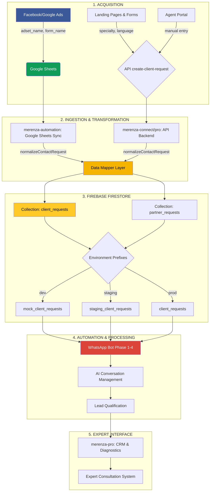

# 📋 Merenza Data Standardization Guide - Master Reference

**Version**: 2.0 (Unified)
**Date**: October 2025
**Scope**: All Merenza projects (merenza-connect, merenza-pro, merenza-automation, merenza-leads)
**Status**: ✅ **PRODUCTION-READY**

---

## ⚠️ **CRITICAL IMPORTANCE**

This guide is **MANDATORY** for all team members working with:
- Facebook/Google Ads marketing campaigns
- Lead import/export operations
- Development on merenza-connect, merenza-pro, or merenza-automation
- WhatsApp bot configuration
- CRM and diagnostic systems

**Non-compliance with these standards can BREAK the automated conversation system and create critical data inconsistencies.**

---

## 📑 Table of Contents

1. [Objectives & Benefits](#objectives--benefits)
2. [Data Flow Architecture](#data-flow-architecture)
3. [Universal Field Standards](#universal-field-standards)
4. [Naming Conventions](#naming-conventions)
5. [Service Types & Specialties](#service-types--specialties)
6. [Geographic & Language Standards](#geographic--language-standards)
7. [Inconsistency Analysis](#inconsistency-analysis)
8. [Harmonization Solutions](#harmonization-solutions)
9. [Project-Specific Standards](#project-specific-standards)
10. [Quality System & Metrics](#quality-system--metrics)
11. [Developer Guide](#developer-guide)
12. [Marketing Guide](#marketing-guide)
13. [Troubleshooting](#troubleshooting)

---

## 🎯 Objectives & Benefits

### Problems Resolved
- ✅ Consistency between merenza-connect, merenza-pro, and merenza-automation
- ✅ WhatsApp bot treats all prospects identically
- ✅ Automatic detection of language, specialty, and service type
- ✅ Backward compatibility with existing campaigns
- ✅ Automatic data quality monitoring

### Benefits
- 🚀 **Complete Automation**: No manual categorization needed
- 🔍 **Intelligent Detection**: Language and service auto-detected
- 📊 **Quality Guaranteed**: 85%+ quality score on all data
- 🔄 **Cross-Project Consistency**: Same logic everywhere
- ⚡ **Scalability**: Easy to add new services/languages

---

## 🏗️ Data Flow Architecture

### Complete System Overview



### Data Flow Friction Points

| Friction Point | Source | Impact | Solution |
|----------------|--------|--------|----------|
| **Contact Fields** | Different field names (name/fullName/clientName) | Mapping errors, automation breaks | Universal field standards (Section 3) |
| **Specialty Classification** | Inconsistent specialty/type/serviceType | Wrong service detection | Standardized taxonomy (Section 5) |
| **Marketing Data** | Missing or malformed adset_name | Campaign tracking fails | Naming conventions (Section 4) |
| **Status Tracking** | lead vs pending_review | Automation delays | Unified status system (Section 3.4) |

---

## 📋 Universal Field Standards

### 5 Core Contact Fields

**CRITICAL**: All Merenza projects use **exactly the same field names** for contact information.

| # | Standard Field | Type | Description | Deprecated Names |
|---|----------------|------|-------------|------------------|
| 1 | `fullName` | string | Full name of client/partner | `clientName`, `partnerName`, `name` |
| 2 | `email` | string | Email address | `clientEmail`, `partnerEmail` |
| 3 | `phoneNumber` | string | Phone (international format: +XXphoneNumber) | `clientPhone`, `partnerPhone`, `phone` |
| 4 | `country` | string | Country (ISO code or full English name) | `clientCountry`, `partnerCountry` |
| 5 | `language` | string | Preferred language (ISO code: fr, en, es, pt-br) | `clientLanguage`, `partnerLanguage`, `desiredLanguage` |

### Mandatory Usage Rules

#### ✅ DO (Correct)
```javascript
// Create new data with standard fields
const newClient = {
  fullName: "John Doe",
  email: "john@example.com",
  phoneNumber: "+33612345678",
  country: "France",
  language: "fr"
};

// Read with fallback for existing data
const name = data.fullName || data.clientName || data.partnerName;
const email = data.email || data.clientEmail || data.partnerEmail;
const phone = data.phoneNumber || data.clientPhone || data.partnerPhone;
const country = data.country || data.clientCountry || data.partnerCountry;
const language = data.language || data.clientLanguage || data.desiredLanguage;
```

#### ❌ DON'T (Forbidden)
```javascript
// NEVER create new data with old field names
const wrongClient = {
  clientName: "John Doe",        // ❌ Use fullName
  clientEmail: "john@example.com", // ❌ Use email
  clientPhone: "+33612345678"    // ❌ Use phoneNumber
};

// NEVER write to Firebase with old fields
await updateDoc(docRef, {
  clientName: name,  // ❌ Wrong
  fullName: name     // ✅ Correct
});
```

### Specialty & Service Fields

| Field | Type | Values | Description |
|-------|------|--------|-------------|
| `specialty` | string (slug) | veterinarian, psychology, plumber, etc. | Professional specialty |
| `specialtyTitle` | string | "Veterinary Services", etc. | Human-readable title |
| `serviceType` | string | consultation, assistance | Type of service |
| `subSpecialty` | string (optional) | telemedicine, emergency, etc. | Sub-category |

### Marketing Data Fields

| Field | Type | Format | Description |
|-------|------|--------|-------------|
| `adsetName` | string | specialty-serviceType-language-variant | Ad set identifier |
| `campaignName` | string | Free text | Campaign name |
| `adName` | string | Free text | Ad variant name |
| `formName` | string | "Specialty Language" | Lead form name |
| `platform` | string | facebook, google, website, agent_portal | Traffic source |

### Status Fields

| Field | Type | Values | Description |
|-------|------|--------|-------------|
| `status` | string | lead, contacted, qualified, closed_won, etc. | Overall lead status |
| `whatsappStatus` | string | pending, creating, created, active, qualified, closed | WhatsApp automation status |
| `conversationPhase` | string | triage, contact, final | AI conversation phase |

### Impact by Project

#### merenza-pro (Expert Interface)
- API Routes: Validate with standard fields
- Stores: `crmClientsStore.js` uses new fields
- Components: Forms send `fullName`, `email`, `phoneNumber`

#### merenza-connect (Client Interface)
- PaymentForm: Uses `country` instead of `clientCountry`
- ReviewRequest: Props use standard fields
- ContactForm: All languages (fr/en/es/pt) use same fields

#### merenza-automation (WhatsApp Bot)
- Phase 3: Extraction to `fullName`, `email`
- Firebase: Collections use standard fields
- AI Extraction: Same logic for client and partner contexts

#### merenza-leads (Ad Campaigns)
- Facebook/Google Forms: Auto-map to standard fields
- Import: Auto-detect from adset names
- Export: Always in standard format

### Migration & Backward Compatibility

**IMPORTANT**: No manual migration required. Code contains automatic fallbacks.

**How it works**:
1. **Read**: Code checks new field first, then old ones (fallback)
2. **Write**: Always use new fields
3. **Existing data**: Continue working via fallbacks
4. **New data**: Automatically use standard fields

**Example fallback pattern**:
```javascript
// Standardization function with fallbacks
function standardizeClientData(rawData) {
  return {
    fullName: rawData.fullName || rawData.clientName || rawData.partnerName,
    email: rawData.email || rawData.clientEmail || rawData.partnerEmail,
    phoneNumber: rawData.phoneNumber || rawData.clientPhone || rawData.phone,
    country: rawData.country || rawData.clientCountry,
    language: rawData.language || rawData.clientLanguage || rawData.desiredLanguage || 'en'
  };
}
```

### Version History

- **Old version** (pre-standardization): `clientName`, `clientEmail`, `clientPhone`, `clientCountry`, `clientLanguage`
- **Current version** (post-standardization): `fullName`, `email`, `phoneNumber`, `country`, `language`
- **Standardization date**: October 2025
- **Files affected**: 156 files across merenza-connect (67), merenza-pro (18), merenza-automation (71)

---

## 🏷️ Naming Conventions

### Adset Name Format

**Standard format**: `specialty-serviceType-language-variant`

#### ✅ Correct Examples
```
✅ televet-consultation-en-ugc
✅ televet-consultation-fr-video
✅ psychology-consultation-es-therapy
✅ plumber-assistance-en-emergency
✅ immigration-consultation-pt-br-family
✅ passenger-transport-transport-en-airport
✅ passenger-transport-transport-fr-business
✅ it-training-training-en-webdev
✅ it-training-training-pt-br-python
```

#### ❌ Examples to Avoid
```
❌ random-televet-stuff-fr
❌ test-campaign-123
❌ fb-ads-veterinary
```

### Form Name Format

**Standard format**: `Service Language` or `Specialty Language`

#### ✅ Correct Examples
```
✅ Televet EN
✅ Psychology FR
✅ Plumber ES
✅ Immigration PT-BR
✅ Passenger Transport EN
✅ Passenger Transport FR
✅ IT Training EN
✅ IT Training PT-BR
```

#### ❌ Examples to Avoid
```
❌ Form 123
❌ Test Lead
❌ Campaign Form
```

---

## 🔧 Service Types & Specialties

### Service Types

#### Consultation (Teleconsultation/Online Services)
- **Code**: `consultation`
- **Keywords detected**: consultation, teleconsultation, telemedicine, telehealth, online, virtual, remote, video
- **Examples**: Veterinary teleconsultation, online psychologist, legal consultation

#### Assistance (Home/On-site Services)
- **Code**: `assistance`
- **Keywords detected**: assistance, home, domicile, onsite, visit, emergency, urgency, mobile
- **Examples**: Home plumber, home nurse, repair technician

#### Transport (Passenger Transport Services)
- **Code**: `transport`
- **Keywords detected**: transport, passenger, transfer, shuttle, driver, vehicle, trip, route
- **Examples**: Airport transfer, private driver, group transport, coach rental

#### Training (Professional Training Services)
- **Code**: `training`
- **Keywords detected**: training, formation, course, learning, education, skill, professional development
- **Examples**: IT training, professional courses, skill development programs

### Standard Specialties

#### Medical Services (require prescription)
- `veterinarian` - Veterinary services
- `generalist` - General medicine
- `psychology` - Psychology services
- `dermatology` - Dermatology
- `dentistry` - Dental services
- `physiotherapy` - Physiotherapy
- `telehealth` - General telemedicine

#### Non-Medical Services
- `plumber` - Plumbing
- `electrician` - Electricity
- `locksmith` - Locksmith
- `handyman` - Handyman
- `cleaning-service` - Cleaning service
- `immigration-law` - Immigration law
- `family-law` - Family law
- `employment-law` - Employment law
- `passenger-transport` - Passenger transport services (sedan, minivan, coach)
- `it-training` - IT professional training and skill development

---

## 🌍 Geographic & Language Standards

### Supported Languages (ISO Codes)

| Code | Language | Usage |
|------|----------|-------|
| `en` | English | International campaigns |
| `fr` | French | France, French Canada |
| `es` | Spanish | Spain, Latin America |
| `pt-br` | Brazilian Portuguese | Brazil |
| `pt` | Portuguese | Portugal |
| `de` | German | Germany, Austria |
| `it` | Italian | Italy |

### Important Rules
- **ALWAYS** use ISO codes (not "spanish", "french", etc.)
- **ALWAYS** include language in adset and form names
- For Brazilian Portuguese, use `pt-br` (not just `pt`)

### Country Standards

**CRITICAL**: Country names must ALWAYS be in English.

```javascript
const COUNTRY_STANDARDS = {
  // ✅ CORRECT
  "Brazil": { countryCode: "55", language: "pt" },
  "Portugal": { countryCode: "351", language: "pt" },
  "France": { countryCode: "33", language: "fr" },
  "Spain": { countryCode: "34", language: "es" },

  // ❌ NEVER USE
  "Brésil": "WRONG",  // French name
  "BR": "WRONG",      // Country code
}
```

### Phone Number Standards

**Format**: `+{countryCode}{localNumber}`

#### ✅ Correct Examples
```
+5511987654321    // Brazil mobile
+351912345678     // Portugal mobile
+33612345678      // France mobile
+34612345678      // Spain mobile
```

#### Phone Field Priority
1. `phoneNumber` (primary)
2. `clientPhone` (secondary)
3. `phone` (fallback)

---

## 🔍 Inconsistency Analysis

### Detected Inconsistencies Across Projects

#### 1️⃣ Contact Fields (Name, Email, Phone)

| Source | Name | Email | Phone | Status |
|--------|------|-------|-------|--------|
| **STANDARD** | `fullName` | `email` | `phoneNumber` | ✅ Reference |
| Google Sheets Sync | `full_name` → `fullName` | `email` | `phone_number` → `phoneNumber` | ✅ Compliant |
| ContactForm (en-US) | `name` | `email` | `phone` | ⚠️ Inconsistent |
| ContactFormModal | `formData.name` | `formData.email` | `formData.phone` | ⚠️ Inconsistent |
| chat/ContactForm | `N/A (chat)` | `email` | `phoneNumber` | ⚠️ Partial |
| create-client-request API (connect) | `clientName` | `clientEmail` | `clientPhone` | ❌ Non-standard |
| create-client-request API (pro) | `clientName` | `clientEmail` | `N/A` | ❌ Non-standard |
| Phase 3 Automation | `clientName` | `clientEmail` | `phoneNumber` | ⚠️ Mixed |

**❌ Problem**: 4 different naming conventions for the same data

#### 2️⃣ Specialty & Service Fields

| Source | Specialty | Service Type | Sub-specialty | Category |
|--------|-----------|--------------|---------------|----------|
| **STANDARD** | `specialty` (slug) | `serviceType` | `subSpecialty` | N/A |
| Google Sheets Sync | `specialty` (string) | `type` | `subType` | `category` |
| Phase 3 Automation | `specialty` | N/A | N/A | N/A |
| ContactFormModal | `specialty` (urlParams) | `type` (urlParams) | N/A | N/A |

**❌ Problem**:
- `serviceType` vs `type` vs missing field
- `category` present in Google Sheets but absent elsewhere
- `prospectType` created by Google Sheets but not used in Phase 3

#### 3️⃣ Marketing Data (FB/Google Ads Campaigns)

| Source | Adset Name | Campaign Name | Ad Name | Form Name | Platform |
|--------|-----------|---------------|---------|-----------|----------|
| **STANDARD** | Format: `specialty-serviceType-language-variant` | ✅ | ✅ | `Specialty Language` | ✅ |
| Google Sheets Sync | `adset_name` → `adsetName` | `campaign_name` → `campaignName` | `ad_name` → `adName` | `form_name` → `formName` | `platform` |
| ContactFormModal | In `sourceDetails` (inconsistent) | `campaignName` | `adName` | N/A | `platform: 'website'` |
| create-client-request API | ❌ Absent | ❌ Absent | ❌ Absent | ❌ Absent | `platform: 'agent_portal'` |

**❌ Problem**:
- Standard `adsetName` format not validated in contact forms
- Marketing data absent in agent requests
- Snake_case naming in Google Sheets then converted to camelCase (error source)

#### 4️⃣ Status & Phase Tracking

| Source | Initial Status | Conversation Phases |
|--------|---------------|---------------------|
| Google Sheets Sync | `status: 'lead'` | N/A |
| create-client-request (connect) | `status: 'pending_review'` | N/A |
| create-client-request (pro) | `status: 'pending_review'` | N/A |
| Phase 3 Automation | N/A | `conversationPhase`, `whatsappStatus` |

**❌ Problem**:
- 2 different statuses for new request (`lead` vs `pending_review`)
- Phase 3 adds its own fields without coordinating with initial status

#### 5️⃣ Collections & Environments

| Project | Collections | Environment Prefixes | Status |
|---------|------------|---------------------|---------|
| **merenza-connect** | `client_requests`, `partner_requests` | `mock_`, `staging_`, none | ✅ Compliant |
| **merenza-pro** | `client_requests`, `partner_requests` | `mock_`, `staging_`, none | ✅ Compliant |
| **merenza-automation** | `partner_requests`, `client_requests` | Depends on `NEXT_PUBLIC_APP_ENV` | ✅ Compliant |

**✅ Compliance**: Excellent - all projects use same prefix system

---

## 🛠️ Harmonization Solutions

### Central Solution: Unified Data Mapper

Create a centralized data mapping service to avoid transformation logic duplication.

#### File to Create: `/merenza-automation/src/utils/dataMapper.js`

```javascript
/**
 * CENTRALIZED DATA MAPPING UTILITIES
 * Ensure consistency across all data sources
 */

const DATA_MAPPING_RULES = {
  // Contact fields mapping
  contact: {
    'name': 'fullName',
    'clientName': 'fullName',
    'full_name': 'fullName',

    'phone': 'phoneNumber',
    'clientPhone': 'phoneNumber',
    'phone_number': 'phoneNumber',

    'clientEmail': 'email',
    'client_email': 'email'
  },

  // Marketing fields mapping
  marketing: {
    'adset_name': 'adsetName',
    'campaign_name': 'campaignName',
    'ad_name': 'adName',
    'form_name': 'formName'
  },

  // Specialty fields mapping
  specialty: {
    'prospectType': 'specialty',
    'type': 'serviceType'
  }
};

/**
 * Normalize contact request data to standard format
 */
function normalizeContactRequest(rawData) {
  return {
    fullName: rawData.fullName || rawData.name || rawData.clientName || rawData.full_name,
    email: rawData.email || rawData.clientEmail,
    phoneNumber: rawData.phoneNumber || rawData.phone || rawData.clientPhone || rawData.phone_number,

    // Marketing data (optional)
    adsetName: rawData.adsetName || rawData.adset_name,
    campaignName: rawData.campaignName || rawData.campaign_name,

    // Specialty data
    specialty: rawData.specialty || rawData.prospectType,
    serviceType: detectServiceType(rawData),

    // Always set standard status
    status: 'lead',
    source: rawData.source || 'unknown',

    // Preserve other fields
    ...rawData
  };
}

/**
 * Detect service type (consultation or assistance)
 */
function detectServiceType(rawData) {
  if (rawData.serviceType) return rawData.serviceType;
  if (rawData.type && ['consultation', 'assistance'].includes(rawData.type)) return rawData.type;
  if (rawData.adsetName && rawData.adsetName.includes('assistance')) return 'assistance';
  return 'consultation'; // Default
}

/**
 * Validate adset name format according to standard
 */
function validateAdsetNameFormat(adsetName) {
  if (!adsetName) return { valid: false, reason: 'Missing adset name' };

  const pattern = /^[\w-]+-(?:consultation|assistance)-(?:en|fr|es|pt-br|pt|de|it)-[\w-]+$/;
  if (!pattern.test(adsetName)) {
    return {
      valid: false,
      reason: 'Format should be: specialty-serviceType-language-variant'
    };
  }

  return { valid: true };
}

/**
 * Calculate data quality score (0-100)
 */
function calculateDataQualityScore(data) {
  let score = 0;

  // Contact completeness (40 points)
  if (data.fullName) score += 15;
  if (data.email) score += 15;
  if (data.phoneNumber) score += 10;

  // Marketing data (30 points)
  if (data.adsetName) {
    const validation = validateAdsetNameFormat(data.adsetName);
    score += validation.valid ? 30 : 15;
  }

  // Specialty data (20 points)
  if (data.specialty) score += 10;
  if (data.serviceType) score += 10;

  // Language & country (10 points)
  if (data.language) score += 5;
  if (data.country) score += 5;

  return score;
}

module.exports = {
  DATA_MAPPING_RULES,
  normalizeContactRequest,
  detectServiceType,
  validateAdsetNameFormat,
  calculateDataQualityScore
};
```

### Implementation Phases

#### Phase 1: Preparation (High Priority - 2h)
- [ ] Create `/merenza-automation/src/utils/dataMapper.js`
- [ ] Create `/merenza-automation/src/utils/dataValidator.js`
- [ ] Write unit tests for mapping functions
- [ ] Document all mappings

#### Phase 2: Backend Harmonization (High Priority - 4h)
- [ ] Integrate `normalizeContactRequest()` in `google-sheets-sync.service.js`
- [ ] Add validation with `validateAdsetNameFormat()` and warning logs
- [ ] Calculate `qualificationScore` for each prospect
- [ ] Modify `/merenza-connect/src/app/api/create-client-request/route.js`
- [ ] Modify `/merenza-pro/src/app/api/create-client-request/route.js`
- [ ] Change `status: 'pending_review'` → `status: 'lead'`

#### Phase 3: Frontend Harmonization (Medium Priority - 3h)
- [ ] Update `/merenza-connect/src/components/consultation/en-US/ContactForm.jsx`
- [ ] Update `/merenza-connect/src/components/consultation/en-US/ContactFormModal.jsx`
- [ ] Verify `/merenza-connect/src/components/consultation/en-US/chat/ContactForm.jsx`

#### Phase 4: Automation Phase 3 Harmonization (Medium Priority - 3h)
- [ ] Update all step handlers (`step-1-problem.js` to `step-6-final.js`)
- [ ] Replace `clientName` → `fullName`
- [ ] Add `validateSpecialtySlug()` in `analyzeContext()`
- [ ] Update `phase3-orchestrator.js` with automatic mapping

#### Phase 5: Tests & Validation (High Priority - 2h)
- [ ] Test Google Sheets Sync with standard format
- [ ] Test contact forms → verify Firestore data
- [ ] Test Agent Portal → verify status = 'lead'
- [ ] Test Phase 3 Automation → verify all standard fields

#### Phase 6: Documentation & Migration (Low Priority - 1h)
- [ ] Update this guide with migration information
- [ ] Create `/scripts/migrate-legacy-data.js` (optional)

**Total Estimated Time**: 15 hours

---

## 🔧 Project-Specific Standards

### merenza-automation: WhatsApp Conversation System

#### Dual-Context System

The architecture uses **identical field names** for clients and partners with **different semantic meanings**:

| Field | Client Context (Medical) | Partner Context (Business) |
|-------|-------------------------|----------------------------|
| `problemDescription` | Medical problem/symptoms | Business goal/professional objective |
| `duration` | Symptom duration | Launch timeline/start date |
| `urgencyLevel` | Medical urgency/severity | Business priority/urgency |
| Collection | `client_requests` | `partner_requests` |

**Architecture Benefits**:
- ✅ Same data structure (no breaking changes)
- ✅ Shared code (Phase 3 orchestrator and step handlers)
- ✅ Contextual AI (each step loads appropriate specialty config)
- ✅ Separated workflows (routes `/client/*` vs `/partner/*`)

#### WhatsApp Status Fields

| Field | Type | Values | Description |
|-------|------|--------|-------------|
| `whatsappStatus` | string | pending, creating, created, active, qualified, closed | WhatsApp workflow status |
| `conversationPhase` | string | triage, contact, final | AI conversation phase |
| `lastAIContext` | object | - | Last AI conversation state |
| `nextAutomationAction` | string | contact_creation, conversation_start, etc. | Next sequence to trigger |

#### Activity History Standards

All `client_requests` documents MUST maintain activity history for traceability.

**Standard Entry Format**:
```javascript
{
  action: "contact_search_dynamic|contact_creation_dynamic|message_sent|message_received",
  timestamp: "2025-10-11T14:30:00.000Z", // ISO 8601
  contactIdentifier: "+33641737555",
  details: {
    message: "Message content",
    direction: "sent|received",
    stepNumber: 1,  // For Phase 3 modular
    stepName: "problemDescription",  // For Phase 3
    phase: "triage|contact|final",
    progress: 17  // Percentage
  },
  result: "success|error",
  error: "Error message if result=error"
}
```

**CRITICAL**: Always use `arrayUnion()` for activity history to avoid overwriting:
```javascript
const { arrayUnion, serverTimestamp } = require('firebase/firestore');

await updateDoc(clientRef, {
  activityHistory: arrayUnion({
    action: 'message_sent',
    timestamp: new Date().toISOString(),
    contactIdentifier: phoneNumber,
    details: { message: botResponse, direction: 'sent' },
    result: 'success'
  }),
  updatedAt: serverTimestamp()
});
```

#### Phase 3 Modular Architecture

| Step | Field Collected | Phase | Progress |
|------|-----------------|-------|----------|
| 1 | problemDescription | triage | 17% |
| 2 | duration | triage | 34% |
| 3 | urgencyLevel | triage | 50% |
| 4 | clientName | contact | 67% |
| 5 | clientEmail | contact | 84% |
| 6 | consultationLink | final | 100% |

**Step 6 (Final) is critical** for Phase 4 eligibility detection.

#### Phase 4 Activity Logging

**Sub-Phases**:
- `phase4_link_resend` - Consultation link resent
- `phase4_objection` - Objection handled
- `phase4_faq` - FAQ question answered
- `phase4_general` - General conversational response
- `phase4_fallback` - Fallback response

**FAQ Metadata**:
```javascript
{
  action: 'phase4_message_sent',
  details: {
    phase: 'phase4_faq',
    faqCategory: 'pricing|howto|timing|services|booking|payment|trust|support',
    faqScore: 0.92,  // 0.0-1.0
    faqMethod: 'semantic|keyword|keyword_fallback'
  }
}
```

#### Inactivity Tracking

**Structure**:
```javascript
{
  inactivityTracking: {
    lastInactivityCheckAt: "2025-10-20T07:25:00.000Z",
    inactivityDurationMinutes: 65,
    currentStage: null | "60min" | "24h" | "48h" | "completed",
    nextReactivationDue: "2025-10-20T08:20:00.000Z",
    isEligibleForReactivation: true,
    reactivationsSent: [
      {
        stage: "60min",
        sentAt: "2025-10-20T08:20:00.000Z",
        messageType: "gentle_reminder",
        success: true
      }
    ],
    pausedAt: "2025-10-20T07:20:00.000Z",
    pausedInPhase: "triage",
    pausedAtStep: 2
  }
}
```

**Reactivation Stages**:
- `60min` (1 hour) - Gentle reminder
- `24h` (24 hours) - Empathetic check-in
- `48h` (48 hours) - Final opportunity with link
- `completed` - All reactivations sent

### merenza-connect & merenza-pro: CRM & Diagnostics

#### Diagnostic IA System

**Collections Architecture**: Multi-environment with fallback priority

```javascript
// Diagnostics loading (production first)
diagnostics → mock_diagnostics → staging_diagnostics

// Experts loading (mock first for test data)
mock_users → users → staging_users
```

**Diagnostic Document Structure**:
```javascript
{
  id: "diagnostic_id",

  // Expert metadata (optimized cross-references)
  expertId: "expert_user_id",
  expertName: "Dr. Jean Dupont",
  expertSpecialty: "veterinarian",

  // Auto-detection of sector
  sector: "medical|legal|business|technical",
  urgencyLevel: "urgent|standard",

  // Normalized client data
  client: {
    name: "John Doe",
    age: "35 ans",
    details: "70kg, additional descriptors"
  },

  // Structured AI content
  diagnosis: "Professional analysis...",
  recommendations: [
    {
      name: "Treatment/Recommendation",
      specification: "Dosage/Scope",
      frequency: "Frequency/Timeline",
      duration: "Duration",
      instructions: "Specific instructions"
    }
  ],
  instructions: "General instructions...",

  // Business metadata
  price: 25.00,
  currency: "USD",
  paymentStatus: "unpaid|paid",
  stripePaymentIntentId: "pi_xxx",

  // Firebase timestamps
  createdAt: serverTimestamp(),
  paidAt: serverTimestamp()
}
```

**Expert Document with Stamps**:
```javascript
{
  uid: "expert_user_id",
  fullName: "Dr. Jean Dupont",
  specialty: "veterinarian",
  licenseNumber: "FR-MD-123456",

  // Unified contact (flexible structure)
  email: "email@domain.com",
  phone: "+33 1 23 45 67 89",
  country: "France",  // String OR object {name, code}
  address: {
    street: "123 Rue Example",
    city: "Paris",
    zipCode: "75014",
    country: "France",
    fullAddress: "123 Rue Example, 75014 Paris, France"
  },

  // Professional documents (Firebase Storage URLs)
  stampUrl: "https://firebasestorage.googleapis.com/.../stamp.png",
  signatureUrl: "https://firebasestorage.googleapis.com/.../signature.png",

  role: "PROVIDER",
  createdAt: serverTimestamp()
}
```

**Automatic Sector Detection**:
```javascript
function detectSectorFromContent(diagnostic, expert) {
  const diagnosis = diagnostic.diagnosis?.toLowerCase() || '';

  // Priority 1: Legal keywords
  if (diagnosis.includes('contract|legal|dispute|lawsuit')) return 'legal';

  // Priority 2: Business keywords
  if (diagnosis.includes('business|marketing|strategy|company')) return 'business';

  // Priority 3: Technical keywords
  if (diagnosis.includes('software|technical|engineering')) return 'technical';

  // Default: medical (includes veterinary)
  return 'medical';
}
```

**Firebase Image Handling** (stamps, signatures):
```javascript
// Server-side conversion to base64 for @react-pdf/renderer compatibility
const isNode = typeof window === 'undefined';

if (isNode) {
  const fetch = (await import('node-fetch')).default;
  const buffer = await response.buffer();
  return `data:${contentType};base64,${buffer.toString('base64')}`;
} else {
  const blob = await response.blob();
  return new Promise(resolve => {
    const reader = new FileReader();
    reader.onloadend = () => resolve(reader.result);
    reader.readAsDataURL(blob);
  });
}
```

**Safe Render Helper** (prevent React object errors):
```javascript
const safeRender = (value, fallback = 'Not specified') => {
  if (value === null || value === undefined) return fallback;
  if (typeof value === 'string' || typeof value === 'number') return value;
  if (typeof value === 'object') {
    if (value.fullAddress) return value.fullAddress;  // Addresses
    if (value.name) return value.name;  // Named objects
    if (value.seconds) return new Date(value.seconds * 1000);  // Timestamps
    return fallback;
  }
  return String(value);
};
```

#### CRM IA Auto-Fill System

**Generated Notes Structure**:
```javascript
{
  "CLIENT PROFILE": "Client background and context",
  "EXPERT ASSESSMENT": "Analysis from specialist perspective",
  "COMMUNICATION SUMMARY": "Interaction history",
  "PROFESSIONAL OBSERVATIONS": "Expertise-based insights",
  "SERVICE REQUIREMENTS": "Needs analysis aligned with specialty",
  "NEXT STEPS": "Recommended specific actions",
  "CONTEXT NOTES": "Regional and specialized considerations"
}
```

**Permission Logic**:
```javascript
const isClientRevealed = client?.revealedBy === currentUser?.uid || client?.isRevealed === true;
const isReadOnly = mode === 'view-only' || (!isClientRevealed && client?.id);
const canEdit = !isReadOnly && currentUser?.uid;

// States:
// - 🔒 Locked: Client not revealed, editing forbidden
// - ✅ Unlocked: Client revealed by user, editing authorized
// - 👁️ View-only: Explicit read-only mode
```

**Auto-Save with Debounce**:
```javascript
const debouncedAutoSave = useMemo(() => {
  let timeoutId;
  return (newFormData) => {
    clearTimeout(timeoutId);
    timeoutId = setTimeout(() => autoSave(newFormData), 1000);
  };
}, [autoSaveEnabled, canEdit, client?.id, mode, currentUser?.uid]);

// Triggers when:
// - User has edit permissions ✅
// - Auto-save enabled ✅
// - Existing client (not new) ✅
// - 1 second after last modification ✅
```

**Extended CRM Fields**:
```javascript
{
  // Revelation system (NEW)
  revealedBy: "user_uid",
  revealedAt: serverTimestamp(),
  isRevealed: boolean,

  // AI metadata (NEW)
  aiGeneratedNotes: boolean,
  aiGeneratedAt: serverTimestamp(),

  // Auto-save tracking
  lastModifiedBy: "user_uid",
  updatedAt: serverTimestamp()
}
```

---

## 📊 Quality System & Metrics

### Data Quality Score (0-100)

#### Excellent Score (90-100)
- ✅ Adset format perfectly compliant with standard
- ✅ Specialty validated against official list
- ✅ Language auto-detected
- ✅ Service type correctly detected
- ✅ All required data present

#### Good Score (80-89)
- ✅ Adset format partially standard
- ⚠️ Specialty detected by heuristics
- ✅ Language detected
- ⚠️ Some data missing

#### Passable Score (70-79)
- ⚠️ Non-standard adset format but detection successful
- ⚠️ Unvalidated specialty
- ⚠️ Language detected by fallback
- ❌ Several data missing

#### Critical Score (<70)
- ❌ Unrecognized adset format
- ❌ Unknown specialty
- ❌ Language not detected
- ❌ Service type not detected

### Automatic Alert Thresholds
- **Average score < 85%**: Critical alert
- **Parsing rate < 80%**: Review adset names
- **>5 unknown specialties**: Update list

### Global Objectives
- **Average quality score: 85%+**
- **Adset parsing rate: 90%+**
- **Language detection: 95%+**
- **Specialty validation: 90%+**
- **Zero critical validation errors**

### KPIs by Team

#### Marketing Team
- % of campaigns using standard format
- Average quality score of new prospects
- Number of unrecognized specialties per month

#### Dev Team
- Standardization system response time
- Number of quality alerts per week
- % synchronization between projects

### Diagnostics Quality Metrics (merenza-pro)
- **Stamp conversion rate**: 95%+ (Firebase → base64)
- **Automatic sector detection**: 90%+ accuracy
- **Single-page PDF rendering**: 100% of diagnostics
- **Preview/PDF consistency**: Identical design

### CRM Quality Metrics (merenza-pro)
- **AI note generation success**: 95%+
- **Minimum note length**: 200 words (1000+ characters)
- **Auto-save delay**: 1 second optimal
- **Permission accuracy**: 100% respect revelation system
- **Confirmed save**: 0% data loss

---

## 👨‍💻 Developer Guide

### Critical Files - NEVER Modify Without Caution

#### merenza-connect
```
⛔ /src/utils/constants/serviceTypes.js
⛔ /src/utils/constants/specialties.js
⛔ /src/utils/dataStandardization.js
⛔ /scripts/sales_assistant/database_controller.js
```

#### merenza-pro
```
⛔ /src/utils/constants/serviceTypes.js
⛔ /src/utils/constants/specialties.js
⛔ /src/utils/dataStandardization.js
⛔ /src/app/api/sync-google-sheets/route.js
```

#### merenza-automation
```
⛔ /src/utils/dataMapper.js (new)
⛔ /src/core/client/specialties/index.js
⛔ /src/sequences/*/conversation-*.js
```

### Modification Rules

1. **MANDATORY SYNCHRONIZATION**: Any modification must be replicated in both projects
2. **TESTS REQUIRED**: Test with `test-data-standardization.js`
3. **BACKWARD COMPATIBILITY**: Never break existing formats
4. **DOCUMENTATION**: Update this guide simultaneously

### Adding a New Specialty

1. **Add to `specialties.js`** (both projects)
```javascript
export const SPECIALTY_SLUGS = {
  // ...existing
  'new-specialty': true, // true if medical, false otherwise
};
```

2. **Add French mapping**
```javascript
export const FRENCH_TITLE_TO_SLUG = {
  // ...existing
  'nouvelle spécialité': 'new-specialty',
};
```

3. **Test detection**
```bash
cd scripts && node test-data-standardization.js
```

4. **Update this guide**

### Environment Collections

```javascript
const COLLECTIONS = {
  development: "mock_client_requests",
  staging: "staging_client_requests",
  production: "client_requests"
};

// CRITICAL: Always use getCollection() helper
import { getCollection } from '@/utils/firebase';
const clientsRef = getCollection('client_requests');
```

### Error Handling Standards

```javascript
const ERROR_TYPES = {
  "VALIDATION_ERROR": "Invalid client data",
  "PHONE_FORMAT_ERROR": "Incorrect phone format",
  "COUNTRY_DETECTION_ERROR": "Country not detectable",
  "WHATSAPP_CONNECTION_ERROR": "WhatsApp connection problem",
  "FIREBASE_ERROR": "Database error",
  "AI_PARSING_ERROR": "AI parsing failed"
};
```

### Logging Standards

```javascript
// Standard log format
{
  timestamp: "2025-10-08T14:30:00Z",
  level: "info|warn|error",
  module: "contact-creation|conversation-start|etc",
  clientId: "doc_id",
  action: "action_performed",
  result: "success|failure",
  details: { /* context */ },
  duration: 1234 // ms
}
```

---

## 📢 Marketing Guide

### Creating a New Campaign

#### ✅ Pre-Launch Checklist

1. **Adset name follows standard format?**
   - `specialty-serviceType-language-variant` ✅
   - Example: `televet-consultation-fr-ugc` ✅

2. **Form name includes specialty and language?**
   - Format: `Specialty Language` ✅
   - Example: `Televet FR` ✅

3. **Specialty is in official list?**
   - Check in this guide "Specialties" section ✅
   - If new, request addition to developers ✅

4. **Language uses ISO code?**
   - `en`, `fr`, `es`, `pt-br`, etc. ✅
   - Not `french`, `english` ❌

### Migrating Old Campaigns

**Old campaigns continue working** thanks to backward compatibility, but to optimize:

#### Migration Examples

**Before (still works)**:
```
❗ televet-en-ads → Score: ~75%
❗ Home-Nurse-en-saas-offer-ads → Score: ~80%
```

**After (recommended)**:
```
✅ televet-consultation-en-ugc → Score: 95%+
✅ home-nursing-assistance-en-emergency → Score: 95%+
```

### Performance Monitoring

#### Automatic Reports
- Each Google Sheets import generates an **automatic quality report**
- Alerts appear in synchronization logs
- Average score visible in synchronization API

#### When to Act
- **Score < 85%**: Review adset names
- **"Unknown specialty"**: Contact dev team
- **"Language not detected"**: Add ISO code to name

---

## 🚨 Troubleshooting

### Problem: "Prospect ignored (no recognized keyword)"

#### Possible Causes
- Adset name contains no recognized keyword
- Completely new specialty
- Completely non-standard format

#### Solutions
1. Verify adset contains a specialty from the list
2. Use standard format: `specialty-serviceType-language-variant`
3. Add recognized keywords: consultation, assistance, televet, etc.

### Problem: "Low quality score (<70%)"

#### Possible Causes
- Missing data (email, name, phone)
- Unrecognized adset format
- Unknown specialty

#### Solutions
1. Verify Google Sheets data is complete
2. Migrate to standard adset format
3. Request addition of new specialties

### Problem: "WhatsApp bot not processing prospect"

#### Possible Causes
- Incorrect status in Firebase
- Service type not detected
- Inconsistent data between projects

#### Solutions
1. Verify status is 'lead' after import
2. Verify type is 'consultation' or 'assistance'
3. Restart data standardization

### Problem: "Bot reprocessing own messages in Phase 4"

#### Root Cause
`detectNewClientMessage()` wasn't filtering Phase 4 message types

#### Solution
Enhanced message filtering now includes:
- `phase4_message_sent`
- `final_message_sent`
- All processed action types

**Status**: ✅ Fixed in merenza-automation v4.1

### Problem: "Phase 4 not activating after modular Phase 3"

#### Root Cause
Phase 4 eligibility check didn't recognize modular Phase 3 Step 6 completion

#### Solution
Added 5th eligibility criterion detecting:
```javascript
entry.action === 'message_sent' &&
entry.details?.stepNumber === 6 &&
entry.details?.stepName === 'final'
```

**Status**: ✅ Fixed in merenza-automation v4.1

---

## 🚫 Common Errors to Avoid

### ❌ Red Flags

1. **Countries in French**: "Brésil" instead of "Brazil"
2. **Over-anonymization**: Replace real names with Contact_XXXX
3. **Messages with generic names**: "Olá Contact_1234"
4. **Inconsistent statuses**: qualified → lead (regression)
5. **Badly formatted phones**: "5511987654321" instead of "+5511987654321"
6. **❌ CRITICAL: Localhost links in production**: Use `https://merenza.com` as fallback
7. **❌ CRITICAL: Markdown in WhatsApp**: WhatsApp does NOT interpret markdown - use plain text only
8. **Activity history overwritten**: Always use `arrayUnion()`, never `=`
9. **FAQs directly in company-knowledge-base.js**: Use specialty files, not inline
10. **❌ CRITICAL: Non-standard action types**: NEVER use `phase4_message_received` - use `message_received` with `phase4Context: true`
11. **❌ CRITICAL: Incomplete message filtering**: Filter ALL processed action types including `phase4_message_sent`, `final_message_sent`

### ✅ Best Practices

1. **Systematic validation** before any operation
2. **Detailed logs** for debugging
3. **Real device tests** for WhatsApp
4. **Backup before mass modifications**
5. **Preview mode** before correction scripts
6. **Double storage**: activityHistory + conversation_analysis
7. **Environment variables**: Always verify NEXT_PUBLIC_APP_URL
8. **Standardized logging**: Use `message_received` for ALL user messages with context flags
9. **Complete message filtering**: Filter all processed action types when detecting new messages
10. **Phase 4 eligibility**: Ensure Phase 3 Step 6 logs include `stepNumber: 6` and `stepName: 'final'`

---

## 🔄 Update Process

### When to Update This Guide

1. **Adding a new specialty**
2. **New service type**
3. **New supported language**
4. **Changing alert thresholds**
5. **Modifying naming conventions**

### Validation Process

1. **Modify constants files**
2. **Test with test scripts**
3. **Deploy in both projects**
4. **Update this guide**
5. **Communicate to teams**

---

## 🆘 Contacts & Support

### For Technical Questions
- **Data standardization**: Dev Team
- **Quality system**: Dev Team
- **WhatsApp bot**: Dev Team
- **CRM/Diagnostics**: Dev Team

### For Marketing Questions
- **Naming conventions**: Lead Marketing
- **New campaigns**: Marketing Team
- **Adset performance**: Performance Marketing

### Emergencies
- **System broken**: Dev Team immediately
- **Corrupted data**: Dev Team + Data
- **Bot not responding**: Dev Team immediately

---

## 📅 Version History

### Version 2.0 - October 2025 (Current)
**Major update - Unified guide**
- ✅ Merged 6 separate documents into single source of truth
- ✅ Added complete data flow architecture diagrams
- ✅ Integrated inconsistency analysis from audits
- ✅ Added comprehensive harmonization solutions
- ✅ Documented merenza-automation WhatsApp system (Phase 1-4)
- ✅ Added CRM IA auto-fill system documentation
- ✅ Added diagnostic IA system documentation
- ✅ Included inactivity tracking standards
- ✅ Documented Phase 3 modular architecture
- ✅ Added Phase 4 FAQ & support system
- ✅ Bug fixes documented (Bot reprocessing, Phase 4 activation)

### Version 1.1 - September 2025
- Added diagnostic IA system
- Added multi-environment collections
- Added Firebase image handling
- Added CRM IA auto-fill + smart editing

### Version 1.0 - September 2025
- Initial standardization guide
- Basic field standards
- Naming conventions
- Service types & specialties

---

**📋 This guide is a living document. It must be updated with every system evolution.**

**✅ Current version: 2.0 - October 2025**

**Maintained by**: Merenza Technical Team
**Review cycle**: Monthly or after major changes
**Status**: ✅ **PRODUCTION-READY** - Validated across all projects
